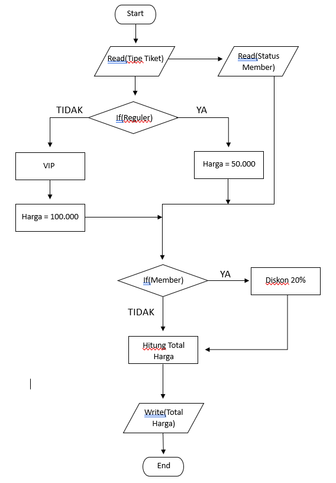

# LAPORAN PRAKTIKUM 2

## CODE PROGRAM PEMESANAN TIKET BIOSKOP

### Step 1 : Input Harga Tiket
Masukan/input Harga Reguler dan Harga VIP, Reguler = Rp50.000 dan VIP = Rp100.000 :

### Step 2 : Perintah Input untuk Tipe Tiket
Selanjutnya, beri perintah input untuk menentukan tipe tiket apa yang akan diambil, (Reguler/VIP?) Member(Ya/Tidak?) :

### Step 3 : Seleksi Tipe Tiket
Beri seleksi untuk menentukan Tipe Tiket yang diambil, Reguler atau VIP tarik inputan dari Step 2 :

### Step 4 : Seleksi Kartu Member untuk diskon
Lalu, input diskon 20% jika memiliki Kartu Member :

### Step 5 : Total harga 
Masukan Total Harga Tiket yang diambil, tarik inputan dari step 3 untuk menemukan totalnya :

### Step 6 : Output 
Print output dari Total Harga Tiket yang sudah diambil :

### Step 7 : Test Code Program
Uji coba code program dengan menginput Tiket Reguler dan memiliki Kartu Member, maka total harganya adalah Rp40.000:

## FLOWCHART PEMESANAN TIKET BIOSKOP

### Step 1 : Start
Buat titik start untuk awalan untuk memulai sesuatu dengan bentuk terminator :

### Step 2 : Input 
Lalu buat Input untuk Tipe Tiket yang akan diambil, dan Input untuk Member :

### step 3 : Decision Tiket Reguler dan VIP
Selanjutnya lakukan seleksi, jika reguler YA maka akan mengarah ke harga tiket Rp50.000, jika TIDAK maka akan mengarah ke Tiket VIP yang berharga Rp100.000 :

### Step 4 : Decision Tiket Member
Setelah itu, dari step sebelumnya Input member menuju Decision Tiket Member, Tiket Reguler dan Tiket VIP mengikuti jalur menuju Decision Tiket Member juga untuk seleksi apakah memiliki Kartu Member atau Tidak, jika YA maka akan dapat diskon 20%, jika tidak menuju step selanjutnya :
 

### Step 5 : End
Step selanjutnya print output Total Harga yang harus dibayar, lalu menuju titik berhenti :

