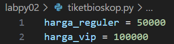

# LAPORAN PRAKTIKUM 2

## CODE PEMROGRAMAN PEMESANAN TIKET BIOSKOP

### Step 1 :
Masukan/input Harga Reguler dan Harga VIP, Reguler = Rp 50.000 dan VIP = Rp 100.000 :

### Step 2 :
Selanjutnya, beri perintah input untuk menentukan tipe tiket apa yang akan diambil, (Reguler/VIP?) Member(Ya/Tidak?) :

### Step 3 :
Beri seleksi untuk menentukan Tipe Tiket yang diambil, Reguler atau VIP tarik inputan dari Step 2 :

### Step 4 :
Lalu, input diskon 20% jika memiliki Kartu Member :

### Step 5 :
Masukan Total Harga Tiket yang diambil, tarik inputan dari step 3 untuk menemukan totalnya :

### Step 6 :
Print output dari Total Harga Tiket yang sudah diambil :

### Step 7 :
Uji coba code program dengan menginput Tiket Reguler dan memiliki Kartu Member, maka total harganya adalah Rp40.000:

